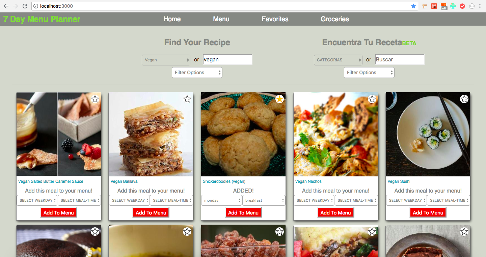
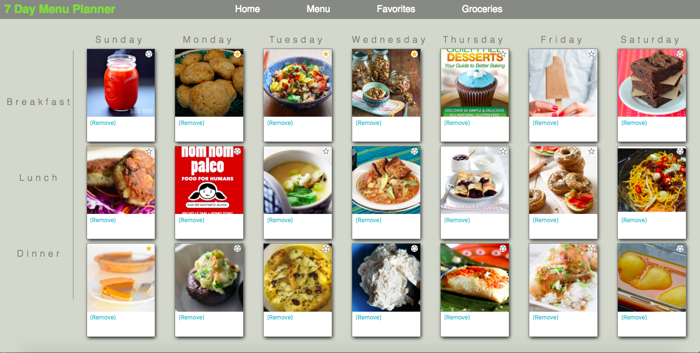
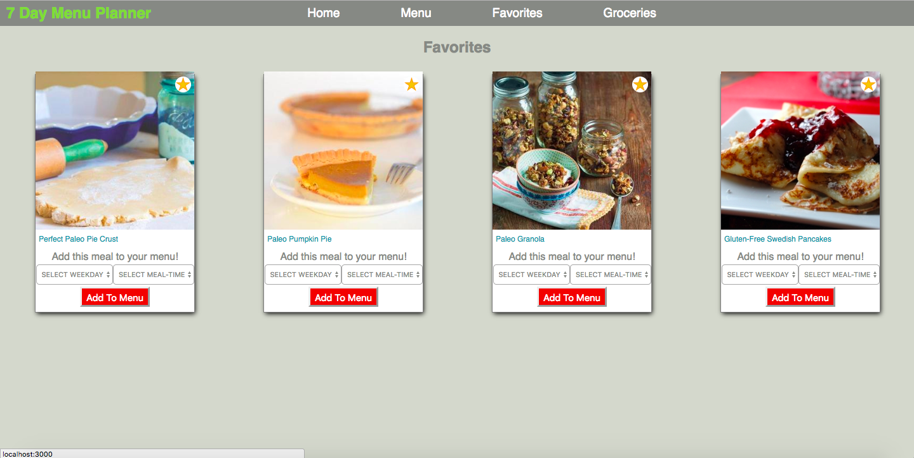
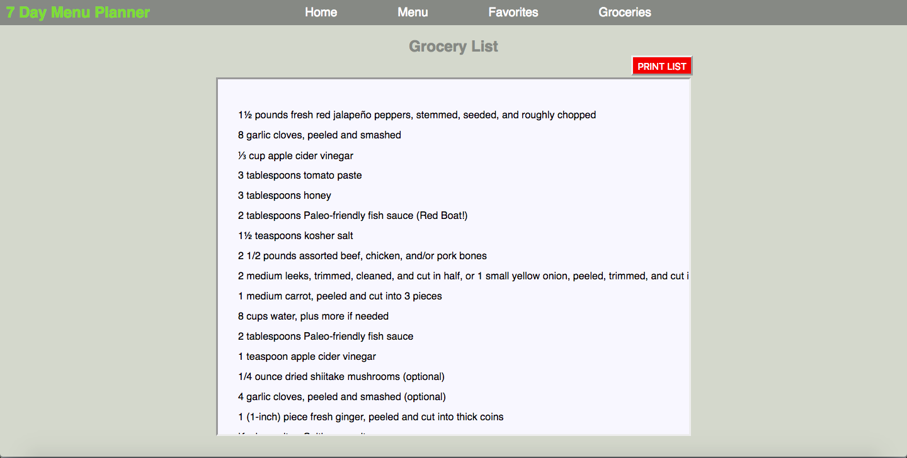

# 7-Day-Menu-Planner

### Overview
7 Day Menu Planner fetches data from Edamam API and allows users to search and filter recipes, favorite recipes, and click to add to a 7 day menu plan. Users can print out a grocery list that is automatically compiled as recipes are added to or deleted from the menu plan. Pages persist using local storage.  

### Technologies
React - Router - Redux - Saga - Jest - Enzyme

### Tools
[Edamam API](https://developer.edamam.com/) - GitHub Projects

### What I learned
With this project, my goal was to do pure TDD style coding, consistently submit microcommits, and have a thoroughly mapped out wireframe of the state-tree and file structure before beginning the project. I learned why it's particularly important to have good styling wireframes with modular code structure.

### Example

